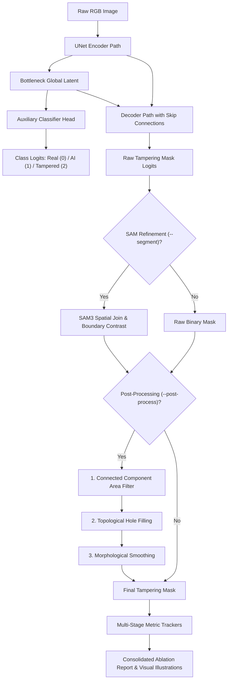
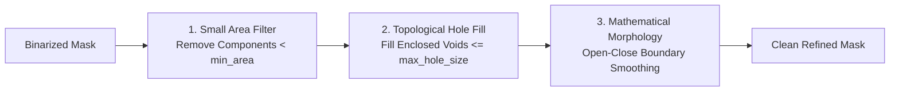

# SID-UNet: UNet for AI-Generated Synthetic Image Masking & Classification

[](https://www.python.org/)
[](https://pytorch.org/)
[](https://huggingface.co/datasets/saberzl/SID_Set)
[](https://opensource.org/licenses/Apache-2.0)

A modular, config-driven PyTorch framework for detecting and segmenting AI-generated or tampered regions in images using a **UNet** architecture with an optional **3-class auxiliary classification head** (`Real`, `Fully AI`, `Partially AI / Inpainting`).

Supports large-scale streaming and local datasets including standard 2-column image/mask datasets like [**KhangTruong/IMD2020**](https://huggingface.co/datasets/KhangTruong/IMD2020) and multi-class datasets like [**saberzl/SID_Set**](https://huggingface.co/datasets/saberzl/SID_Set), featuring native **streaming dataset support** (`streaming = True`), flexible loss functions (BCE, Soft Dice, Focal, Combined), comprehensive metric tracking, rich Markdown/JSON evaluation reports, and a complete unit/integration test suite.

---

## Table of Contents

- [Key Features](#key-features)
- [Dataset Specification](#dataset-specification)
- [Architecture](#architecture)
- [Mechanisms & Architectural Principles](#mechanisms--architectural-principles)
  - [1. Problem Formulation & Task Definition](#1-problem-formulation--task-definition)
  - [2. UNet Multi-Scale Feature Representation & Skip Connections](#2-unet-multi-scale-feature-representation--skip-connections)
  - [3. Auxiliary Classifier & Multi-Task Semantic Regularization](#3-auxiliary-classifier--multi-task-semantic-regularization)
  - [4. Streaming Dataset Engine & Dynamic Mask Synthesis](#4-streaming-dataset-engine--dynamic-mask-synthesis)
  - [5. Mask Post-Processing Pipeline (Noise Suppression, Hole Filling, Morphology)](#5-mask-post-processing-pipeline-noise-suppression-hole-filling-morphology)
  - [6. SAM3 Spatial Join & Boundary Contrast Refinement](#6-sam3-spatial-join--boundary-contrast-refinement)
  - [7. Simultaneous Multi-Stage Ablation Evaluation](#7-simultaneous-multi-stage-ablation-evaluation)
  - [8. Automated Visual Illustration & Heatmap Generation](#8-automated-visual-illustration--heatmap-generation)
  - [9. Memory Management & OOM Dynamic Auto-Recovery](#9-memory-management--oom-dynamic-auto-recovery)
- [Installation](#installation)
- [Project Structure](#project-structure)
- [Configuration System](#configuration-system)
- [Quickstart: How to Run](#quickstart-how-to-run)
  - [1. Training](#1-training)
  - [2. Evaluation & Benchmarking](#2-evaluation--benchmarking)
  - [3. Inference & Mask Prediction](#3-inference--mask-prediction)
- [Loss Functions & Metrics](#loss-functions--metrics)
- [Running Tests](#running-tests)
- [License](#license)

---

## Key Features

- **Streaming-First Dataset Pipeline**: Natively consumes massive Hugging Face datasets with `streaming = True` (or non-streaming if configured), preventing disk storage exhaustion.
- **Universal Dataset Support**:
  - **Standard 2-Column Datasets ([KhangTruong/IMD2020](https://huggingface.co/datasets/KhangTruong/IMD2020))**: Contains `image` and `mask` across all three official subsets: **`train`**, **`validation`**, and **`test`**. Masks are directly normalized and binarized, and classification labels are automatically derived.
  - **3-Class Labeled Datasets ([saberzl/SID_Set](https://huggingface.co/datasets/saberzl/SID_Set))**:
    - **Label `0` (Real/Authentic)**: Target mask is **full black** (all $0$s).
    - **Label `1` (Fully Synthetic)**: Target mask is **full white** (all $1$s).
    - **Label `2` (Partially Synthetic / Tampered)**: Ground truth mask loaded from dataset, normalized, and binarized.
- **Robust Subset & Split Resolution**:
  - Automatically loads and evaluates on explicit `test`, `validation`, or `train` splits.
  - Transparently falls back to `validation` when evaluating datasets where `val == test` (or datasets missing an explicit `test` split).

---

## Dataset Specification

The framework supports multiple dataset formats:

### 1. Common / Regular 2-Column Format ([KhangTruong/IMD2020](https://huggingface.co/datasets/KhangTruong/IMD2020))
- **Subsets Available**: `train`, `validation`, and `test`.
- `image`: RGB image (PIL Image or tensor).
- `mask`: Binary / grayscale segmentation mask for manipulated or inpainted regions.
- When `label` is not provided in the dataset, class indicators are inferred automatically from pixel statistics ($0$: all-zero mask / authentic, $1$: all-one mask / fully synthetic, $2$: mixed mask / tampered).

### 2. Multi-Class Labeled Format ([saberzl/SID_Set](https://huggingface.co/datasets/saberzl/SID_Set))
- `image`: RGB image ($1024 \times 1024$ or variable resolutions).
- `label`: Integer class indicator ($0, 1, 2$).
- `mask`: Segmentation mask for tampered/inpainted regions.
  - When `label == 0`, mask is treated as **all zeros ($0$)**.
  - When `label == 1`, mask is treated as **all ones ($1$)**.
  - When `label == 2`, `mask` is extracted from the sample and thresholded to binary $\{0.0, 1.0\}$.

---

## Architecture

```
                      Input Image (3, H, W)
                               │
               ┌───────────────▼───────────────┐
               │    DoubleConv (in -> 64)      │───────────────┐ (Skip 1)
               └───────────────┬───────────────┘               │
               ┌───────────────▼───────────────┐               │
               │   Down: MaxPool -> Conv (128) │─────────────┐ │ (Skip 2)
               └───────────────┬───────────────┘             │ │
               ┌───────────────▼───────────────┐             │ │
               │   Down: MaxPool -> Conv (256) │───────────┐ │ │ (Skip 3)
               └───────────────┬───────────────┘           │ │ │
               ┌───────────────▼───────────────┐           │ │ │
               │   Down: MaxPool -> Conv (512) │─────────┐ │ │ │ (Skip 4)
               └───────────────┬───────────────┘         │ │ │ │
                               ▼                         │ │ │ │
               ┌───────────────────────────────┐         │ │ │ │
               │     Bottleneck Conv (512)     │         │ │ │ │
               └───────┬───────────────┬───────┘         │ │ │ │
                       │               │                 │ │ │ │
                       │       ┌───────▼──────────────┐  │ │ │ │
                       │       │ Auxiliary Classifier │  │ │ │ │
                       │       │ AdaptivePool -> MLP  │  │ │ │ │
                       │       └───────┬──────────────┘  │ │ │ │
                       │               ▼                 │ │ │ │
                       │     Class Logits (B, 3)         │ │ │ │
                       │                                 │ │ │ │
               ┌───────▼───────────────────────┐         │ │ │ │
               │ Up: Bilinear + Conv (256)     │◄────────┘ │ │ │
               └───────┬───────────────────────┘           │ │ │
               ┌───────▼───────────────────────┐           │ │ │
               │ Up: Bilinear + Conv (128)     │◄──────────┘ │ │
               └───────┬───────────────────────┘             │ │
               ┌───────▼───────────────────────┐             │ │
               │ Up: Bilinear + Conv (64)      │◄────────────┘ │
               └───────┬───────────────────────┘               │
               ┌───────▼───────────────────────┐               │
               │ Up: Bilinear + Conv (64)      │◄──────────────┘
               └───────┬───────────────────────┘
               ┌───────▼───────────────┐
               │   OutConv: 1x1 Conv   │
               └───────┬───────────────┘
                       ▼
              Binary Mask Logits (1, H, W)
```

---

## Mechanisms & Architectural Principles

SID-UNet is engineered with a modular, multi-stage pipeline designed specifically for detecting, localizing, and refining AI-generated and manipulated image content. Below is an in-depth breakdown of the underlying mechanisms driving each system component.



### 1. Problem Formulation & Task Definition

Synthetic image forensics in SID-UNet addresses two complementary levels of visual inspection:
1. **Global Scene Categorization**: Classifying whether an entire image is natural / authentic ($y=0$), completely synthesized by a generative model like Stable Diffusion, Midjourney, or DALL-E ($y=1$), or authentic with localized synthetic inpainting or object splicing ($y=2$).
2. **Dense Pixel Localization**: Estimating a dense binary probability map $\hat{M} \in [0, 1]^{H \times W}$, where each spatial coordinate $(i, j)$ represents the posterior probability that pixel $(i, j)$ was artificially generated or modified:
   $$\hat{M}_{i,j} = P(\text{Pixel } (i,j) \text{ is synthetic} \mid I)$$

### 2. UNet Multi-Scale Feature Representation & Skip Connections

UNet employs a symmetric U-shaped encoder-decoder topology with skip connections:
- **Hierarchical Encoder**: Downsampling via successive $2 \times 2$ max-pooling layers progressively contracts spatial resolution while doubling feature channels ($64 \to 128 \to 256 \to 512$). Each stage applies two consecutive $3 \times 3$ convolutions, batch normalization, and ReLU activations. The contracting path extracts deep semantic descriptors and identifies global structural inconsistencies typical of generative models (e.g. asymmetrical anatomical structures, improper lighting, or perspective flaws).
- **Multi-Scale Skip Connections**: Convolutional downsampling inevitably loses high-frequency spatial boundaries. The skip connections concatenate high-resolution feature activations directly from contracting encoder layers into corresponding expanding decoder layers. This provides the decoder with precise local edge gradients, frequency traces, and color-transition boundaries essential for segmenting crisp tampering borders.
- **Progressive Upsampling Decoder**: Bilinear interpolation (or learned transposed convolutions) doubles spatial resolution at each step ($512 \to 256 \to 128 \to 64$) while reducing feature channels. Concatenated features are processed through double convolutions to synthesize seamless boundary predictions.
- **OutConv Layer**: A final $1 \times 1$ convolution projects the 64-channel decoded representation to a 1-channel logit map:
  $$z = \text{OutConv}(f_{\text{dec}}) \in \mathbb{R}^{1 \times H \times W}, \quad \hat{p} = \sigma(z) = \frac{1}{1 + e^{-z}}$$

### 3. Auxiliary Classifier & Multi-Task Semantic Regularization

Stand-alone pixel segmentation can overfit to local high-frequency textures (such as sensor noise or camera blur) without understanding high-level scene composition. To enforce semantic grounding:
- **Global Context Extraction**: At the UNet bottleneck ($C_{\text{bot}} = 512$ channels), an `AdaptiveAvgPool2d((1, 1))` pooling operation collapses spatial dimensions $(H/16, W/16)$ to produce a compact 1D latent vector $v \in \mathbb{R}^{512}$.
- **Multi-Layer Perceptron (MLP)**: The latent vector is routed through an auxiliary classifier head:
  $$v \xrightarrow{\text{Linear}(512, 128)} \xrightarrow{\text{ReLU}} \xrightarrow{\text{Dropout}(p=0.2)} \xrightarrow{\text{Linear}(128, 3)} \hat{y}_{\text{cls}} \in \mathbb{R}^3$$
- **Joint Optimization**: The training objective is a composite loss combining mask segmentation loss with auxiliary classification cross-entropy:
  $$\mathcal{L}_{\text{Total}} = \mathcal{L}_{\text{Mask}}(\hat{M}, M_{\text{gt}}) + \lambda_{\text{aux}} \mathcal{L}_{\text{CE}}(\hat{y}_{\text{cls}}, y_{\text{cls}})$$
  Backpropagation of the classification gradient through the shared encoder forces early and intermediate layers to learn representations informative of both global generative provenance and localized pixel manipulation.

### 4. Streaming Dataset Engine & Dynamic Mask Synthesis

To train on massive multi-gigabyte or terabyte forensic datasets (such as `saberzl/SID_Set`, `KhangTruong/IMD2020`, or `KhangTruong/Diffseg30k`) without saturating local storage:
- **Streaming Pipeline (`streaming: true`)**: Samples are streamed on-the-fly over HTTP via Hugging Face `IterableDataset` with shuffle buffers and non-blocking worker prefetching.
- **Automatic Label & Mask Synthesis Logic**:
  - **Label 0 (Real / Authentic)**: Synthesizes a pure zero mask $\mathbf{0}_{H \times W}$.
  - **Label 1 (Fully Synthetic)**: Synthesizes a pure one mask $\mathbf{1}_{H \times W}$.
  - **Label 2 (Tampered / Inpainted)**: Loads the corresponding ground-truth mask, clamps/binarizes values $> 0.5$ to $1.0$, and resizes it to the model input dimensions using nearest-neighbor interpolation to prevent boundary blurring.
- **Dynamic 2-Column Inferencing**: In 2-column image/mask datasets where explicit labels are omitted, class indicators are inferred dynamically from mask pixel coverage:
  $$\text{Ratio} = \frac{1}{H \times W} \sum_{i,j} M_{i,j}, \quad \text{Label} = \begin{cases} 0 & \text{if } \text{Ratio} = 0.0 \\ 1 & \text{if } \text{Ratio} = 1.0 \\ 2 & \text{if } 0.0 < \text{Ratio} < 1.0 \end{cases}$$

### 5. Mask Post-Processing Pipeline (Noise Suppression, Hole Filling, Morphology)

Raw UNet probability maps frequently suffer from isolated high-frequency false positive speckles, jagged perimeter contours, or small cavities inside detected inpainted objects. The post-processing module (`sid_unet.postprocessing.MaskPostProcessor`) applies three consecutive deterministic algorithms:



1. **Connected Component Analysis & Small Area Suppression (`remove_small_components`)**:
   - Uses 8-connectivity neighborhood labeling via `scipy.ndimage.label`.
   - Computes the pixel area of every disjoint connected component $C_k$:
     $$\text{Area}(C_k) = \sum_{(i,j) \in C_k} 1$$
   - Any component with $\text{Area}(C_k) < \text{min\_area}$ (default: $64$ pixels) is suppressed to background ($0$). This cleanly eliminates spurious point noise and detector chatter.
2. **Topological Hole Filling (`fill_mask_holes`)**:
   - Detects negative background regions that are topologically bounded and fully enclosed by positive foreground components (`scipy.ndimage.binary_fill_holes`).
   - Evaluates cavity sizes: background cavities with $\text{size} \le \text{max\_hole_size}$ (default: $256$ pixels) are filled with $1$s. This recovers solid foreground masks for inpainted faces, signs, or objects that contain internal textures.
3. **Mathematical Morphological Smoothing (`apply_morphology`)**:
   - Applies morphological structuring elements ($3 \times 3$ or $5 \times 5$ kernels).
   - **Opening ($\text{Erode} \circ \text{Dilate}$)**: Removes thin protruding tendrils, isolates weak bridges, and separates weakly joined false-positive artifacts.
   - **Closing ($\text{Dilate} \circ \text{Erode}$)**: Seals narrow cracks, micro-indentations, and smooths concave perimeters.
   - **Default (`open_close`)**: Performs opening followed by closing, achieving robust boundary regularization without artificially shrinking or expanding the detected subject.

### 6. SAM3 Spatial Join & Boundary Contrast Refinement

While UNet identifies *where* tampering occurred based on generative artifacts (latent decoder noise, spectral frequency anomalies, blend borders), its convolutional receptive fields can produce fuzzy, pixel-soft boundaries. Conversely, **Segment Anything Model (SAM3)** has state-of-the-art zero-shot semantic boundary awareness but no intrinsic knowledge of generative authenticity.

The hybrid integration (`sid_unet.models.sam3_refiner.SAMRefiner`) executes a **Spatial Join**:
1. **Bounding Box Prompt Extraction**: Bounding boxes are derived from the connected components of the UNet tampering mask.
2. **SAM Object Proposal Generation**: The bounding boxes are supplied to SAM as prompt coordinates, generating precise candidate instance masks along natural image edges.
3. **Intersection & Spatial Join**: A segment is joined into the output tampering mask if its intersection with the UNet prediction exceeds the overlap threshold:
   $$\text{IoU}(S_{\text{SAM}}^k, M_{\text{UNet}}) \ge \tau_{\text{join}}$$
4. **Boundary Contrast**: Unmodified natural background pixels mistakenly captured by UNet dilation are subtracted, aligning the final tampering mask with natural semantic object perimeters.

### 7. Simultaneous Multi-Stage Ablation Evaluation

To transparently measure the isolated contribution of each component without incurring quadrupled forward-pass latency, the evaluation engine (`evaluate.py` and `cross_eval.py`) runs a single forward pass per batch and simultaneously updates four independent metric trackers:

| Variant | Evaluation Path | Primary Focus |
| :--- | :--- | :--- |
| **1. Baseline (Raw UNet)** | Model $\to$ Sigmoid $\to$ Threshold | Measures pure neural network localization capability. |
| **2. + Post-Processing** | Raw Mask $\to$ Area Filter $\to$ Hole Fill $\to$ Morphology | Quantifies suppression of false positive speckles and hole recovery. |
| **3. + SAM Refinement** | Raw Mask $\to$ SAM Prompting $\to$ Spatial Join | Quantifies edge alignment with semantic object boundaries. |
| **4. + SAM & Post-Processing** | SAM Mask $\to$ Post-Processing Pipeline | Evaluates the complete production pipeline with maximal precision. |

The evaluation report dynamically populates an **Ablation Comparison Table** at the top of the report, enabling immediate side-by-side inspection of IoU, Dice/F1, AUROC, and Pixel Accuracy gains.

### 8. Automated Visual Illustration & Heatmap Generation

To provide transparent visual interpretability, `sid_unet/utils/plotting.py` automatically produces and embeds high-resolution figures into the generated Markdown and JSON reports:
- **Qualitative Prediction Grids (`eval_sample_predictions.png`)**: Multi-column comparison displaying:
  $$\text{Input Image} \quad \big| \quad \text{Ground Truth} \quad \big| \quad \text{Raw UNet} \quad \big| \quad \text{Post-Processed} \quad \big| \quad \text{Final Mask} \quad \big| \quad \text{Overlay} \quad \big| \quad \text{Error Map (TP/FP/FN)}$$
- **Ablation Comparison Bar Charts (`eval_ablation_comparison.png`)**: Grouped bar graphs comparing IoU, Dice, Pixel Accuracy, Precision, and Recall across all active pipeline variants.
- **Cross-Evaluation 2D Heatmaps (`cross_eval_*_heatmap.png`)**: Color-coded $N \times M$ matrix heatmaps visualizing generalization performance (Mean IoU, Dice/F1, AUROC) across checkpoints and cross-evaluation datasets (CASIA v2.0, COCO-Glide, Diffseg30k).

### 9. Memory Management & OOM Dynamic Auto-Recovery

To ensure reliable execution on memory-constrained GPUs (e.g. 8GB VRAM cards) or ultra-large batches:
- **Pre-Execution VRAM Probing**: `auto_batch_size` measures free memory and scales physical batch sizes, compensating with gradient accumulation steps.
- **Activation Checkpointing**: Discards forward activation tensors during the forward pass and recomputes them on-demand during backpropagation, saving 60-70% activation VRAM.
- **Dynamic OOM Fallback Catching**: If a CUDA Out-of-Memory exception occurs during training or evaluation:
  1. Catch `torch.cuda.OutOfMemoryError`.
  2. Clear CUDA allocator cache (`torch.cuda.empty_cache()`).
  3. Recursively bisect the batch into micro-batches ($B/2 \to B/4 \to 1$).
  4. Forward/backward propagate micro-batches sequentially and accumulate gradients.
  5. Resume normal execution seamlessly without crashing the job.

---

## Installation

Install in editable mode using `pip` or `uv`:

```bash
# Clone and enter directory
cd /workspace

# Install dependencies and CLI commands
pip install -e .

# Or with development/testing dependencies:
pip install -e ".[dev]"
```

---

## Project Structure

```
├── configs/
│   ├── default.yaml              # Default configuration
│   ├── train_streaming.yaml      # Config tailored for SID_Set streaming
│   ├── train_non_streaming.yaml  # Config for downloaded / map datasets
│   ├── evaluate.yaml             # Dedicated evaluation settings
│   ├── test_smoke.yaml           # Ultra-fast smoke test config
│   ├── test_quick.yaml           # Quick alternative loss test config
│   └── experiments/              # Scaled models, large batch sizes & specialized losses
│       ├── unet_wide_b32.yaml
│       ├── unet_deep_5stage_b32.yaml
│       ├── unet_large_batch_b64.yaml
│       ├── unet_highres_512_b16.yaml
│       ├── unet_heavy_wide_deep_b32.yaml
│       ├── unet_focal_hard_mining_b32.yaml
│       ├── unet_convtranspose_learned_up_b32.yaml
│       └── unet_non_streaming_b32.yaml
├── sid_unet/
│   ├── __init__.py
│   ├── dataset/
│   │   ├── __init__.py
│   │   ├── loader.py             # Streaming & Non-streaming PyTorch DataLoaders
│   │   ├── mask_utils.py         # Label 0/1/2 mask synthesis & normalizers
│   │   └── transforms.py         # Joint augmentations & preprocessing
│   ├── models/
│   │   ├── __init__.py
│   │   ├── blocks.py             # DoubleConv, Down, Up, OutConv, Classifier
│   │   └── unet.py               # UNet architecture with auxiliary classifier
│   ├── losses/
│   │   ├── __init__.py
│   │   ├── bce.py                # Binary Cross Entropy with Logits
│   │   ├── dice.py               # Soft Dice Loss
│   │   ├── focal.py              # Binary Focal Loss
│   │   ├── combined.py           # Combined Mask Loss
│   │   └── auxiliary.py          # Composite Total Loss (Mask + Aux Classification)
│   ├── metrics/
│   │   ├── __init__.py
│   │   ├── segmentation.py       # IoU, Dice/F1, Pixel Acc, Precision, Recall
│   │   └── classification.py     # Accuracy, Macro F1, Confusion Matrix
│   ├── training/
│   │   ├── __init__.py
│   │   ├── callbacks.py          # CheckpointManager and EarlyStopping
│   │   └── trainer.py            # Complete training, validation, and AMP loop
│   ├── utils/
│   │   ├── __init__.py
│   │   ├── config.py             # YAML loading, deep merge, and CLI overrides
│   │   ├── logger.py             # Console and file logger
│   │   └── report.py             # Markdown, JSON, and ASCII report formatting
│   ├── train.py                  # CLI training entrypoint (single & multi-run)
│   ├── evaluate.py               # CLI evaluation entrypoint
│   └── predict.py                # CLI inference entrypoint
├── tests/
│   ├── test_cli.py               # Single and multi-config CLI tests
│   ├── test_config.py            # Config parsing & override tests
│   ├── test_dataset.py           # Dataset sample & sample-limit tests
│   ├── test_losses.py            # Loss functions unit tests
│   ├── test_mask_utils.py        # Mask synthesis logic tests
│   ├── test_metrics.py           # Metric calculation tests
│   ├── test_models.py            # Forward/backward gradient & shape tests
│   ├── test_report.py            # Single & multi-experiment report tests
│   ├── test_trainer_integration.py # End-to-end integration test
│   └── test_transforms.py        # Preprocessing & augmentation tests
├── pyproject.toml                # Pip package specification
├── .gitignore                    # Ignored artifacts & logs
└── README.md                     # Documentation
```

---

## Configuration System

Configurations are written in standard YAML. Any parameter can be overridden via CLI with dot-notation `--override key.nested=value`.

Example `configs/default.yaml`:
```yaml
project:
  name: "sid_unet_baseline"
  seed: 42
  device: "auto"                    # 'auto', 'cuda', or 'cpu'
  output_dir: "outputs"

data:
  dataset_name: "KhangTruong/IMD2020"
  streaming: false                  # false for downloaded datasets, true for streaming
  image_size: [256, 256]            # Input resolution [H, W]
  batch_size: 16
  num_workers: 2
  train_split: "train"
  val_split: "validation"
  test_split: "test"
  train_samples_per_epoch: -1       # -1 for full dataset until depletion
  val_samples: -1                   # -1 for full validation set
  test_samples: -1                  # -1 for full test set
  evaluate_on_test: true            # Automatically evaluate on test set post-training
  augmentations:
    horizontal_flip: 0.5
    vertical_flip: 0.2
    random_rotate90: 0.5

model:
  name: "unet"
  in_channels: 3
  out_channels: 1
  features: [64, 128, 256, 512]
  bilinear: true
  dropout: 0.1
  aux_classifier: false            # Set false for 2-column image/mask datasets like IMD2020 (set true for 3-class datasets like SID_Set)
  num_classes: 3

loss:
  mask_loss_type: "combined"       # 'bce', 'dice', 'focal', or 'combined'
  bce_weight: 0.5
  dice_weight: 0.5
  aux_loss_type: "cross_entropy"
  aux_weight: 0.2                  # Weight for classification loss

training:
  epochs: 10
  learning_rate: 0.001
  weight_decay: 0.0001
  optimizer: "adamw"
  scheduler: "cosine"
  amp: true
  auto_batch_size: true            # Enabled by default to automatically search safe batch size and avoid OOM
  save_best: true
  save_latest: false               # Saves only best model checkpoint by default
  early_stopping_patience: 5
  early_stopping_metric: "val_iou"
  early_stopping_mode: "max"
```

---

## Quickstart: How to Run

### 1. Training

#### A. Single Experiment Training
Run training with a configuration file (includes per-epoch validation and post-training test set evaluation):
```bash
# Using installed CLI command:
sid-train --config configs/default.yaml

# Or using Python module:
python -m sid_unet.train --config configs/default.yaml
```

**Fast Smoke Testing:**
Run minimal 1-epoch / small-step test configurations:
```bash
# Ultra-fast smoke test:
sid-train --config configs/test_smoke.yaml

# Quick alternative loss test:
sid-train --config configs/test_quick.yaml
```

#### B. Multi-Experiment Suite (Run Multiple Configs in One Command)
You can pass multiple configuration files to execute a series of experiments sequentially. Each run gets a clean, dedicated output directory (`RUN001`, `RUN002`, `RUN003`, etc.), and a consolidated markdown & JSON comparative benchmark report is generated automatically:
```bash
sid-train --configs configs/test_smoke.yaml configs/test_quick.yaml --output_dir outputs/benchmark_suite
```

**Override parameters via CLI across runs:**
```bash
python -m sid_unet.train \
  --config configs/train_streaming.yaml \
  --override data.batch_size=32 training.learning_rate=5e-4 data.image_size=[256,256]
```

**Full Dataset Passes (Run Until Dataset Depletes):**
Set `data.train_samples_per_epoch: -1` (or `steps_per_epoch: -1`) to stream or iterate through the entire dataset until depletion rather than truncating to fixed epoch sample counts:
```bash
python -m sid_unet.train \
  --config configs/train_streaming.yaml \
  --override data.train_samples_per_epoch=-1 data.val_samples=-1
```

**Resume from a checkpoint:**
```bash
python -m sid_unet.train \
  --config configs/train_streaming.yaml \
  --resume outputs/streaming_run/checkpoints/checkpoint_best.pt
```

#### C. Handling Large Batch Sizes & GPU Memory (OOM Prevention)
When training on high resolutions or constrained GPU memory, multiple built-in mechanisms prevent Out-of-Memory (OOM) failures:

1. **Automatic Batch Sizing (Enabled by Default)**:
   Probes device VRAM before training and scales down the physical batch size while increasing gradient accumulation steps to maintain the target effective batch size. Pass `--no-auto-batch-size` if you wish to disable auto-tuning:
   ```bash
   python -m sid_unet.train --config configs/default.yaml --batch_size 64
   ```

2. **Gradient Accumulation (`--gradient-accumulation-steps`)**:
   Simulate large effective batch sizes with smaller memory footprints:
   ```bash
   # Effective batch size of 64 using micro-batch size 16 accumulated over 4 steps:
   python -m sid_unet.train --config configs/default.yaml --batch_size 16 --gradient-accumulation-steps 4
   ```

3. **Gradient (Activation) Checkpointing (`--gradient-checkpointing`)**:
   Reduces activation memory by ~60-70% during backpropagation, enabling much larger batches or higher image resolutions:
   ```bash
   python -m sid_unet.train --config configs/default.yaml --gradient-checkpointing
   ```

4. **Dynamic OOM Auto-Recovery**:
   If an unexpected OOM occurs during a training or validation step, the Trainer automatically catches the exception, clears the PyTorch allocator cache, splits the batch into smaller micro-batches, and completes the step seamlessly without crashing the job.

---

### 2. Evaluation & Benchmarking

#### A. Single Checkpoint Evaluation
Evaluate a checkpoint against the test or validation split (reports and illustrations are saved and override in-place in the checkpoint's local run directory, e.g. `outputs/RUN001/eval_reports/`):
```bash
# Standard evaluation on test set (with post-processing and illustrations active by default):
sid-eval --checkpoint outputs/RUN001/checkpoints/checkpoint_best.pt --split test

# Evaluate with SAM3 Mask Refinement (--segment facebook/sam3):
sid-eval \
  --checkpoint outputs/RUN001/checkpoints/checkpoint_best.pt \
  --split test \
  --segment facebook/sam3

# Custom post-processing tuning (min connected component area & morphological smoothing):
sid-eval \
  --checkpoint outputs/RUN001/checkpoints/checkpoint_best.pt \
  --split test \
  --min-area 128 \
  --morphology open_close

# Evaluate pure raw UNet metrics only (disabling post-processing):
sid-eval \
  --checkpoint outputs/RUN001/checkpoints/checkpoint_best.pt \
  --no-post-process

# Or with config overrides:
python -m sid_unet.evaluate \
  --checkpoint outputs/RUN001/checkpoints/checkpoint_best.pt \
  --split test \
  --override data.batch_size=32 data.streaming=false
```

#### B. Multi-Checkpoint Evaluation (Evaluate Multiple Models at Once)
Pass multiple checkpoints or glob patterns to evaluate a suite of models sequentially. Individual reports override in-place in each model's directory, and a consolidated comparative evaluation report (`multi_checkpoint_evaluation.md` / `.json`) with side-by-side metrics is generated:
```bash
# Evaluate multiple checkpoints explicitly:
sid-eval --checkpoints outputs/RUN001/checkpoints/checkpoint_best.pt outputs/RUN002/checkpoints/checkpoint_best.pt --split test

# Evaluate all best checkpoints across all runs via glob pattern:
sid-eval --checkpoints "outputs/RUN*/checkpoints/checkpoint_best.pt" --split test
```

#### C. Cross-Evaluation Matrix Benchmarking (`sid-cross-eval`)
Evaluate multiple checkpoints across multiple dataset configurations ($N \times M$ evaluation matrix):
```bash
# Cross-evaluate checkpoints across Diffseg30k, CASIA v2.0, and COCO-Glide:
sid-cross-eval \
  --cross-configs configs/cross-eval/diffseg30k.yaml configs/cross-eval/casia_v2.0.yaml configs/cross-eval/cocoglide.yaml \
  --checkpoints "outputs/RUN*/checkpoints/checkpoint_best.pt" \
  --split test

# Cross-evaluate with SAM3 Mask Refinement:
sid-cross-eval \
  --cross-configs configs/cross-eval/*.yaml \
  --checkpoints "outputs/RUN*/checkpoints/checkpoint_best.pt" \
  --split test \
  --segment facebook/sam3
```

**Key Cross-Evaluation Behaviors:**
1. **2-Column Image & Mask Mismatch Verification**: Automatically detects and handles image and mask dimension mismatches and verifies dataset column integrity.
2. **Neighbor Reports**: Writes a local cross-evaluation report (`cross_evaluation_report.md` and `.json`) adjacent / neighbor to each checkpoint folder.
3. **Master Cross-Evaluation Report**: Generates a consolidated master report (`master_cross_evaluation_report.md`, `.json`, and `cross_eval_matrix.json`) containing:
   - **Cross-Evaluation Matrices**: 2D grid views for Mean IoU, Dice / F1 Score, AUROC, Pixel Accuracy, and Total Loss.
   - **Cross-Evaluation Heatmaps**: Visual 2D heatmaps saved in `illustrations/cross_eval_*_heatmap.png`.
   - **Master Ranking Table**: Comprehensive ranking of all $(C_i, K_j)$ pairs.
   - **Per-Checkpoint & Per-Dataset Deep-Dives**: Detailed breakdowns including per-label metrics and sample prediction illustration grids.

This outputs a tabulated summary in the terminal and saves:
- `<checkpoint_run_dir>/eval_reports/evaluation_report.md` (overridden in-place)
- `<checkpoint_run_dir>/eval_reports/evaluation_report.json`
- `<checkpoint_run_dir>/eval_reports/illustrations/` (prediction grids and ablation charts)
- `outputs/multi_checkpoint_evaluation.md` (when multiple checkpoints are evaluated)

Example generated report:
```markdown
# SID-UNet Evaluation Report

### 🔬 Pipeline Ablation & Mask Refinement Comparison

| Pipeline Stage / Variant   |   Mean IoU |   Dice / F1 |   Pixel AUROC |   Pixel Acc |   Precision |   Recall |
|----------------------------|------------|-------------|---------------|-------------|-------------|----------|
| Baseline (Raw UNet)        |     0.7820 |      0.8540 |        0.9520 |      0.9380 |      0.8210 |   0.8900 |
| + Post-Processing          |     0.8140 |      0.8810 |        0.9520 |      0.9490 |      0.8650 |   0.8980 |
| + SAM Refinement           |     0.8415 |      0.9023 |        0.9610 |      0.9540 |      0.8876 |   0.9201 |
| + SAM & Post-Processing    |     0.8520 |      0.9115 |        0.9610 |      0.9580 |      0.8950 |   0.9290 |

### Overall Segmentation & Classification Metrics

| Metric                  |   Value |
|-------------------------|---------|
| Eval Total Loss         |  0.3142 |
| Iou                     |  0.8520 |
| Dice / Pixel F1         |  0.9115 |
| Pixel Auroc             |  0.9610 |
| Pixel Acc               |  0.9580 |
| Precision               |  0.8950 |
| Recall                  |  0.9290 |
| Specificity             |  0.9620 |
| Aux Accuracy            |  0.9125 |
| Aux Macro F1            |  0.9080 |
| Total Evaluated Samples | 1000    |

### 🖼️ Evaluation Illustrations & Sample Predictions

**Qualitative Visual Predictions**


**Quantitative Ablation Comparison**

```

---

### 3. Inference & Mask Prediction

Predict binary masks for single images or full directories:

```bash
# Single image prediction
sid-predict \
  --checkpoint outputs/streaming_run/checkpoints/checkpoint_best.pt \
  --image /path/to/test_image.jpg \
  --output_dir predictions \
  --save_overlay

# Single image prediction with SAM3 Mask Refinement:
sid-predict \
  --checkpoint outputs/streaming_run/checkpoints/checkpoint_best.pt \
  --image /path/to/test_image.jpg \
  --output_dir predictions \
  --segment facebook/sam3 \
  --save_overlay

# Directory batch prediction with SAM3 Mask Refinement:
python -m sid_unet.predict \
  --checkpoint outputs/streaming_run/checkpoints/checkpoint_best.pt \
  --input_dir /path/to/image_folder \
  --output_dir predictions \
  --segment facebook/sam3 \
  --threshold 0.5 \
  --save_overlay
```


**Inference Outputs:**
- `<image_name>_mask.png`: Binary mask ($0$ = Authentic background, $255$ = AI-generated).
- `<image_name>_overlay.png`: Semi-transparent red highlight over detected AI regions on the original image.

**Python API Usage:**
```python
import torch
from sid_unet.models import UNet

# Load model directly from checkpoint (architecture and weights restored automatically)
model = UNet.from_checkpoint("outputs/checkpoints/checkpoint_best.pt", device="cuda")

# Run inference
# x: (B, 3, H, W) normalized tensor
with torch.no_grad():
    binary_mask = model.predict_mask(x, threshold=0.5)  # (B, 1, H, W)
```

---

## Loss Functions & Metrics

### Loss Functions

- **BCELoss** (Binary Cross-Entropy with Logits):

$$\mathcal{L}_{\text{BCE}} = - \left[ y \log \sigma(x) + (1 - y) \log (1 - \sigma(x)) \right]$$

- **DiceLoss** (Soft Dice Loss):

$$\mathcal{L}_{\text{Dice}} = 1 - \frac{2 \sum p_i y_i + \epsilon}{\sum p_i + \sum y_i + \epsilon}$$

- **FocalLoss** (Binary Focal Loss with focusing parameter $\gamma$ and balance $\alpha$):

$$\mathcal{L}_{\text{Focal}} = -\alpha_t (1 - p_t)^\gamma \log(p_t)$$

- **Total Composite Loss**:

$$\mathcal{L}_{\text{Total}} = \alpha \mathcal{L}_{\text{BCE}} + \beta \mathcal{L}_{\text{Dice}} + \lambda_{\text{aux}} \mathcal{L}_{\text{CE}}(\hat{y}_{\text{cls}}, y_{\text{cls}})$$

### Metrics Tracked
- **Intersection over Union (IoU / Jaccard Index)**: $\frac{|P \cap T|}{|P \cup T|}$
- **Pixel F1-Score / Dice Coefficient**: $\frac{2 |P \cap T|}{|P| + |T|}$
- **Area Under ROC Curve (AUROC / ROC-AUC)**: Continuous pixel prediction probability ranking performance
- **Pixel Accuracy**: $\frac{\text{TP} + \text{TN}}{\text{Total Pixels}}$
- **Precision, Recall & Specificity**
- **Auxiliary 3-Class Accuracy, Macro F1, and Confusion Matrix**

---

## Running Tests

Run the comprehensive unit and integration test suite:

```bash
# Run all tests
pytest

# Run tests with detailed verbose output
pytest -v

# Run tests with code coverage report
pytest --cov=sid_unet
```

All tests run cleanly without network dependency using synthetic test batches and mocked data fixtures.

---

## License

This project is licensed under the Apache License, Version 2.0 - see the [LICENSE](LICENSE) file for details.
